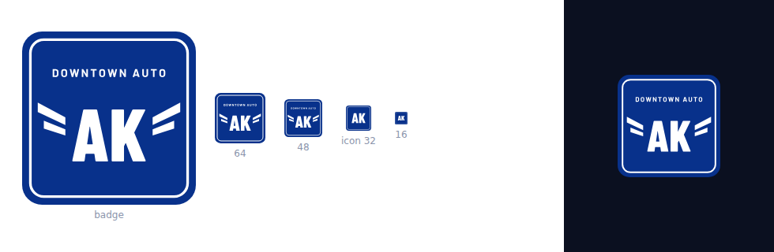

# DAAK — the badge

The rental brand's mark. It is the dealership's own winged badge with the letters
changed, so a customer who already knows Downtown Auto recognises it in half a second —
which is the entire point, because the 4.6-from-92 reputation only transfers if the two
look like the same firm.

## Files

| | |
|---|---|
| `daak-badge.svg` | **Master.** DOWNTOWN AUTO, wings, AK. Use at 48 px and above. |
| `daak-icon.svg` | Small-size artwork: AK alone, 28% larger. 32 px and below. |
| `daak-badge-reverse.svg` | White field, navy mark. For navy grounds and photographs. |
| `favicon.ico` | 16 / 32 / 48 / 64 / 128 / 256, each built from the right artwork. |
| `png/daak-<n>.png` | 1024 → 48 from the badge; 32 and 16 from the icon. |

## Why there are two artworks

The badge holds four things — frame, name, wings, letters. Below about 40 px the name is
a grey smear and the wings stop reading as wings; all four elements collide. So the small
sizes drop the name and the wings and give the letters the room instead.

Every icon set does this. It is not a compromise — it is the same mark at the size it is
actually seen. Compare `icon 32` and `16` in the proof above against the badge beside them.

## The type

| | |
|---|---|
| **AK** | Barlow Condensed 800 |
| **DOWNTOWN AUTO** | Barlow 700, tracked +4 |

Both are **converted to outlines** in the SVG, so the artwork carries no font dependency
and renders identically in a browser, in Illustrator and on a print RIP. Barlow is SIL
Open Font License, free for commercial use, and it is already the typeface the
dealership's own website runs on.

## Construction

| | |
|---|---|
| Canvas | 400 × 400, corner radius 46 |
| Inner frame | inset 19, radius 31, stroke 6 |
| Navy | `#08318B` |
| White | `#FFFFFF` |
| AK | cap height 120 units, ink 169 wide, centred at (200, 240) |
| Name line | 26 pt, centred at (200, 96) |
| Clear space | 23 units — half the corner radius — on every side |
| Minimum size | 16 px on screen, 8 mm in print |

## Do not

- **Stretch it.** The canvas is square and stays square.
- **Recolour it.** Navy and white, nothing else.
- **Add a gradient or a shadow.** It has to survive one-colour print and embroidery.
- **Re-set the letters in a font.** Use these outlines.

## Still open

The wings are drawn from the DAS badge as it appears in a roughly 60-pixel account tile.
The silhouette is right; the fine detail is an interpretation. **Send the original DAS
vector and this gets redrawn against it**, so the two badges are genuinely siblings rather
than merely similar. About an hour's work, and worth doing before anything is printed.

## Where each mark goes

Two brands live on this site and they are not interchangeable.

| | Mark | Where |
|---|---|---|
| **The dealership** | this badge | header, favicon, footer contact block, printed documents |
| **The vendor** | TIFF Software Solutions — the T-monogram | footer credit only: *Site by TIFF Software Solutions* |

Note the one thing the root brief insists on and this folder does not contradict: the
**dealer's** logo is uploaded into the site's profile, never committed into the theme, so
the same theme runs for the next dealership. These files are the source artwork, not a
theme asset.
